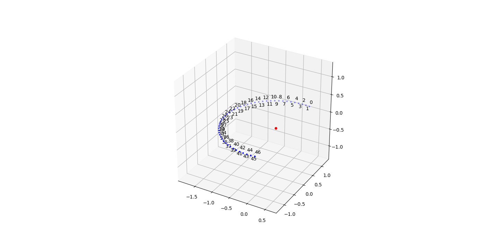
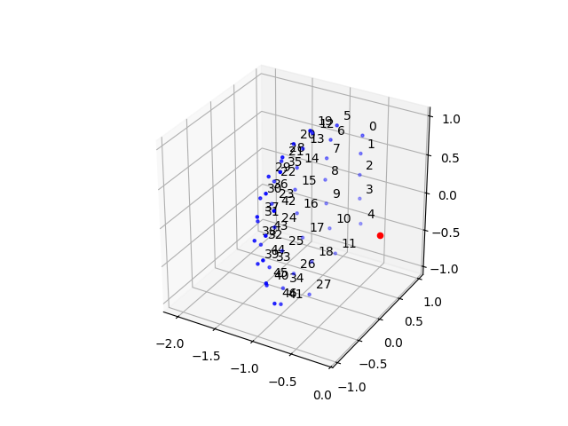
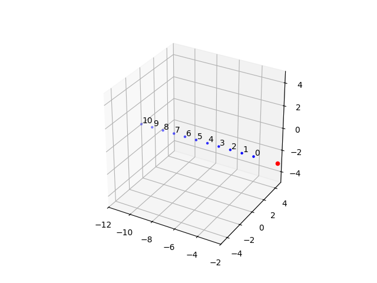

Default and Custom Environments
===============================

The freefield package enables working with diverse experimental conditions. As such it provides pre-defined default options for
setup hardware and TDT-processor configuration, while also giving you the opportunity to customize your own.

Default Setups
--------------
As the freefield library was created with the anechoic experiment chamber of the University of Leipzig in mind, the default
setups refer to the setups used in this lab ("arc" and "dome"), while a headphone setup in the same laboratory ("headphones")
and an array of speakers along the viewing axis ("distance array") are also represented. If you find yourself working with one of
these setups, you can conveniently call them when initializing your setup, e.g.: ::

    freefield.initialize(setup="dome", default="play_rec")

Overview of Default Setups
^^^^^^^^^^^^^^^^^^^^^^^^^^
Below you find a quick introduction to the default setups you can choose from, as well as a visualization of their speaker arrangement.

.. note ::
    You can view a dynamic 3D visualization of any setup by calling ::

        freefield.visualizations.plot_setup(setup)

Arc
...
The rc setups consists of 47 speakers arranged in an azimuthal arc around the listener position, spanning the range of
azimuthal angles from -98.44 degrees to 98.44 degrees with 4.28 degrees step sizes between two neighboring speakers.
Use ``setup="arc"`` when calling :func:`freefield.initialize()` to initialize this setup.

Dome
....
The dome setup consists of 47 speakers spread across both the azimuthal and elevation plane. Use ``setup="arc"``
when calling :func:`freefield.initialize()` to initialize this setup.

Headphones
..........

Distance Array
..............
The distance array consists of 11 speakers, positioned along the viewing axis across a total of 12 meters. Use
``setup="distance_array"`` when calling :func:`freefield.initialize()` to initialize this setup.

Default Processor Configuration (with .rcx-Files)
^^^^^^^^^^^^^^^^^^^^^^^^^^^^^^^^^^^^^^^^^^^^^^^^^
When using one of the default setups you also have the opportunity to use one of the following default modes for the processor
configuration:

 ::

    "play_rec": Enables playing sounds with one or more RX8s and Record with an RP2
    "bi_play_rec"
    "play_birec"
    "loctest_freefield"
    "loctest_headphones"
    "cam_calibration"

Each mode will load different .rcx-files to the Processors of your Setup, enabling different applications.
To use these default modes, initialize your setup as such:

::

    freefield.initialize(setup="dome", default="play_rec")

Customize your own Setup
------------------------
In case you don't work with one of the setups mentioned above and want to implement your own experiment environment,
you have the possibility to do so by creating your own :class:`Setup` object:

::

    import freefield
    from freefield.setups import Setup

    # Define your custom setup
    # Make sure you have a speaker_table (Calibration file is optional)

    my_setup = Setup(
        name="my_setup",
        speaker_table="/path/to/setup_speaker_table.txt",
        calibration_file="/path/to/setup_calibration_file.pkl",
        playback_processors=("RX81", "RX82"),
        )

    # Your custom setup can be passed directly to initialize
    # However, you can't use default modes and
    # you will need to input the processor configuration explicitly

    freefield.initialize(
        setup=my_setup,
        device=[
            ['RX81', 'RX8', 'path/to/processor_configuration.rcx'],
            ['RX82', 'RX8', 'path/to/processor_configuration.rcx']
        ]
    )
.. note::
    For a custom setup, providing a speaker table is necessary. See `Speaker Table`_ on how to create one). You don't have to
    provide a calibration file, however a lot of psychoacoustic paradigms will require your setup to be calibrated. See `Loudspeaker Equalization`
    on how to create a calibration.

Speaker Table
^^^^^^^^^^^^^
The speaker table contains essential information about the speakers in your setup, such as their spatial
position and its connection to the playback hardware. Speaker tables are plain .txt files with comma-separated values.

A simple example of a speaker table looks like this:

::

    index_number,channel,analog_proc,azi,ele,dist,bit,digital_proc
    0,18,RX81,-52.5,25,1.4,,
    1,19,RX81,-52.5,12.5,1.4,,
    2,20,RX82,-52.5,0,1.4,,
    3,21,RX82,-52.5,-12.5,1.4,,

Each row represents one loudspeaker. The first line contains the column names:

    - ``index_number``: Unique speaker index used by freefield, for example in :func:`freefield.pick_speakers()`.
    - ``channel``: Analog output channel to which the speaker is connected.
    - ``analog_proc``: Name of the processor providing the analog output, for example RX81 or RX82.
    - ``azi``: Speaker azimuth in degrees. Negative values indicate positions to the left, positive values positions to the right.
    - ``ele``: Speaker elevation in degrees. 0 corresponds to ear level, with positive values above and negative values below.
    - ``dist``: Distance between the listener and the speaker in meters.
    - ``bit``: Digital output bit associated with the speaker, if required by the setup. Optional.
    - ``digital_proc``: Processor controlling the corresponding digital output. Optional.

Configuration File
^^^^^^^^^^^^^^^^^
TDT processors must be loaded with a processing circuit that defines their behavior. These circuits are created in RPvdsEx and stored as .rcx files.
Those circuits can be created with TDT's graphical programming interface and are saved in the .rcx format. The operation defined by the
circuit will be executed as the device is run.
If you want to understand more about programming these circuits,
check out the `documentation <https://www.tdt.com/files/manuals/RPvdsEx_Manual.pdf>`_ provided by TDT. If you
downloaded the TDT software (see :ref:`Installation`) you can check out some examples in the freefield/data/rcx/ folder.

